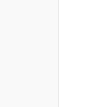
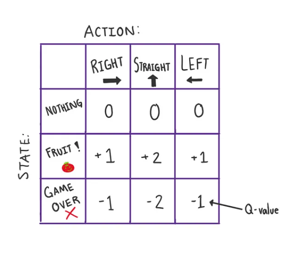
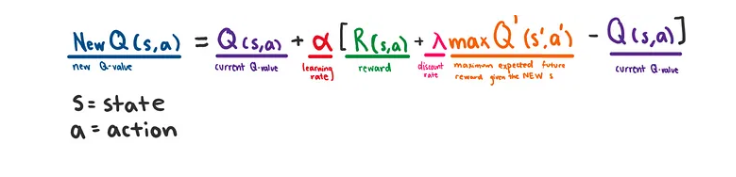
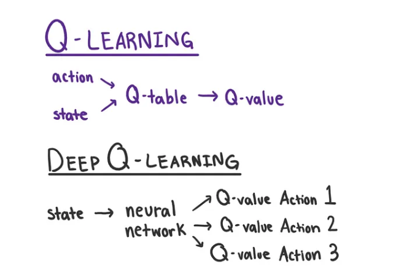
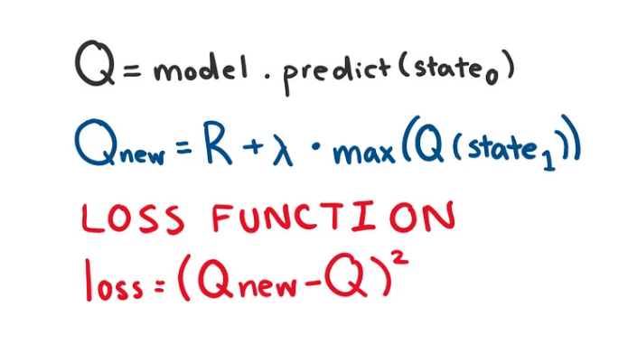

# snakeWithIQ
A snake game that uses AI to find food. Imagine if other animales did the same thing!

# Teaching an AI to play the snake game using reinforcement learning!
# source: https://medium.com/@nancy.q.zhou/teaching-an-ai-to-play-the-snake-game-using-reinforcement-learning-6d2a6e8f3b1c

# We are trying to test how easily is Artificial Intelligence 
# beating us at our own games?

# A good background on Reinforcement learning:
# machine learning technique used to train an agent
# agent = the entity being trained to act upon its environment
# using rewards and punishments to teach positive versus negative
# behaviour. 

# Breakdown:
1. Implement the game and setup the environment
2. Create the Neural Network
3. Implement and Train the Agent

# Packages you need:
1. NumPy: A python library used for working with arrays
2. Matplotlib: Helps plot and create visualizations of data
3. Pytorch: A machine learning framework that helps create neural networks
4. Pygame: Python module designed for video games

## Found Issue with using system variables and trying to solve that at the moment

# Test 1
## Test 2
### Test 3
#### Test 4

### Step 2: Build and train the neural network
1. Create a model to train the network 
2. Choose between 2 models used for reinforcement learning
3. Q - Learning or the Markov Decision Process (MDP)

#### Q-Learning:
1. Finds teh best course of action given current state of the agent through trial and error
2. It does so by randomizing its actions, and repeating what works
3. Q stands for quality
4. If the snake repeatedly dies from hitting the walls at a certain point, the agent will learn that going straight towards walls does NOT lead to best course of action 
5. Next time, it will probably turn before going directly into wall
6. Instead of neural network, Q-learning uses a table that calculates teh maximum expected future reward for each action at each state. 
7. One dimension measures possible actions(the agent's methods to interact and change its environment) while the other dimension is possible states
8. The agent will choose the action with highest reward

### Here is an image to briefly explain this table:

9. Q-learning uses the Belleman equation to create values to make decisions

#### Deep Q-learning:
1. When a table is not very efficient, then that is when deep Q-learning comes
2. Same as Q-learning but with neaural network instead of a table
3. It uses Belleman equation - used in this code

### For this specific project, the Belleman and loss function equations can be simplified down to

### Simple feed-forward neural network with an input later of 11 nodes, a single hidden layer of 256 nodes, and an output lataer of 3 nodes, representing the 3 possible actions the agent can take (right, left, straight)

